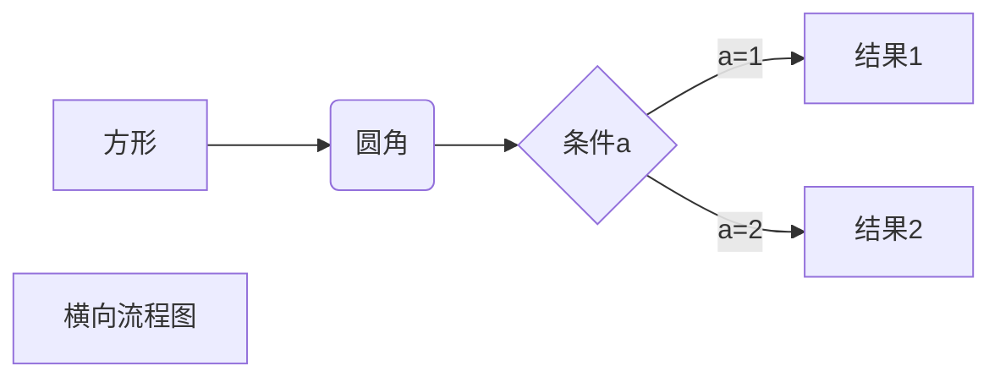
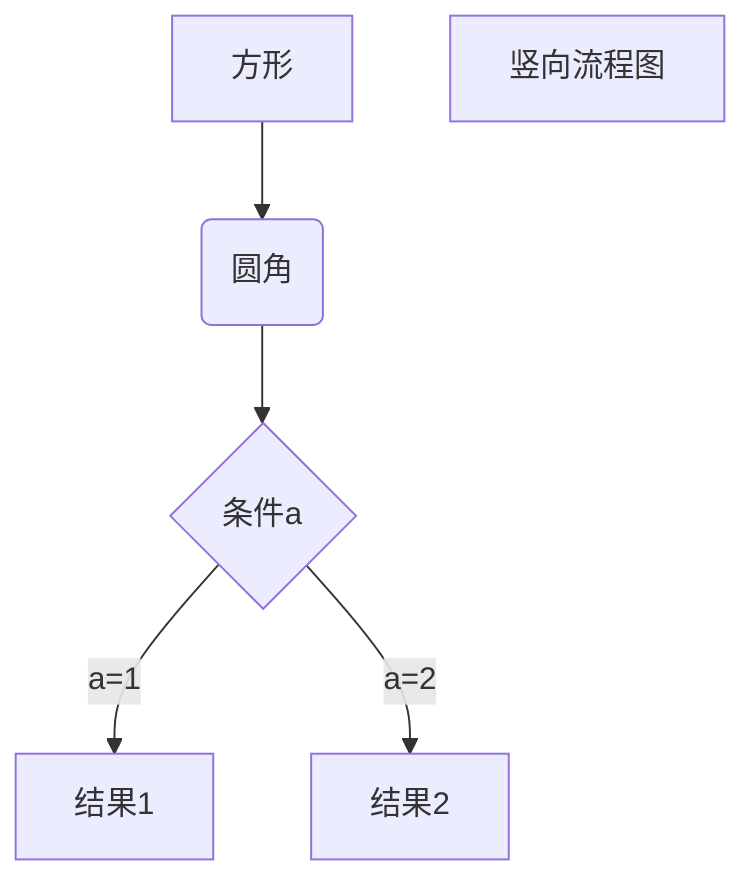
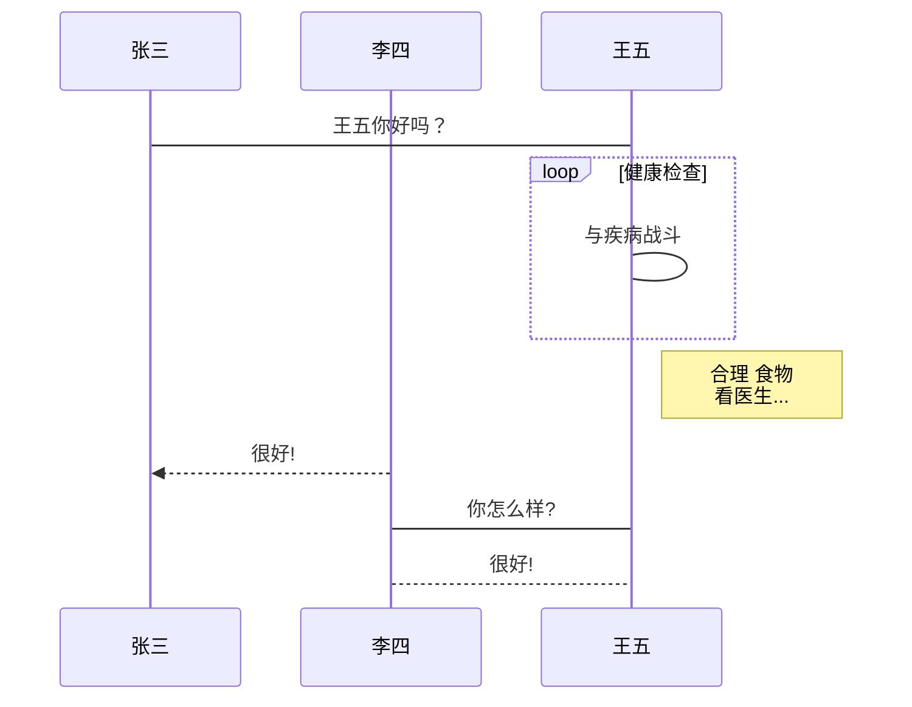
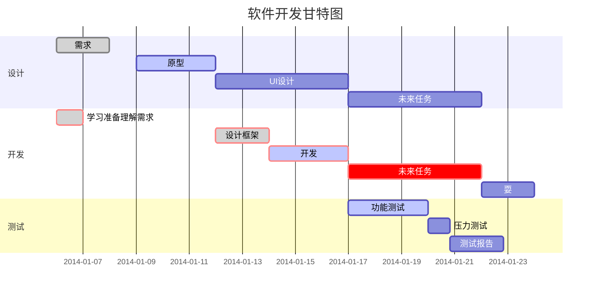

# Markdown速查

## Markdown标题

> 使用 # 号标记

使用 # 号可表示 1-6 级标题，一级标题对应一个 # 号，二级标题对应两个 # 号，以此类推：

```Markdown
# 一级标题
## 二级标题
### 三级标题
#### 四级标题
##### 五级标题
###### 六级标题
```

## Markdown段落

### 字体

Markdown 可以使用以下几种字体：

```Markdown
*斜体文本*
_斜体文本_
**粗体文本**
__粗体文本__
***粗斜体文本***
___粗斜体文本___
```

### 分隔线

你可以在一行中用三个以上的星号、减号、底线来建立一个分隔线，行内不能有其他东西。你也可以在星号或是减号中间插入空格。下面每种写法都可以建立分隔线：

```Markdown
***
* * *
*****
- - -
---------------
```

### 删除线

如果段落上的文字要添加删除线，只需要在文字的两端加上两个波浪线 ~~ 即可，实例如下：

```Markdown
~~BAIDU.COM~~
```

~~BAIDU.COM~~

### 脚注

脚注是对文本的补充说明。

Markdown 脚注的格式如下：

```Markdown
[^要注明的文本]
```

以下实例演示了脚注的用法：

创建脚注格式类似这样 [^RUNOOB]。

[^RUNOOB]: 菜鸟教程 -- 学的不仅是技术，更是梦想！！！

### 下划线

下划线可以通过 HTML 的 `<u>` 标签来实现：

<u>带下划线文本</u> [^ul]

[^ul]: 最好不要用下划线，因为会误以为是超链。

## Markdown 列表

Markdown 支持有序列表和无序列表。

无序列表使用星号(*)、加号(+)或是减号(-)作为列表标记：

```Markdown
* 第一项
* 第二项
* 第三项

+ 第一项
+ 第二项
+ 第三项

- 第一项
- 第二项
- 第三项
```

有序列表使用数字并加上 . 号来表示，如：

> 1. 第一项
> 2. 第二项
> 3. 第三项

列表嵌套只需在子列表中的选项添加四个空格即可：

1. 第一项：
    - 第一项嵌套的第一个元素
    - 第一项嵌套的第二个元素
2. 第二项：
    - 第二项嵌套的第一个元素
    - 第二项嵌套的第二个元素

## Markdown 区块

Markdown 区块引用是在段落开头使用 > 符号 ，然后后面紧跟一个空格符号：

> 区块引用
> 菜鸟教程
> 学的不仅是技术更是梦想

另外区块是可以嵌套的，一个 > 符号是最外层，两个 > 符号是第一层嵌套，以此类推退：

> 最外层
> > 第一层嵌套
> > > 第二层嵌套

## Markdown 代码

如果是段落上的一个函数或片段的代码可以用反引号把它包起来（`），例如：

`printf()` 函数

### 代码区块

代码区块使用 4 个空格或者一个制表符（Tab 键）。如：
    func() {
        test()
    }

也可以用 ``` 包裹一段代码，并指定一种语言（也可以不指定）：

```Javascript
$(document).ready(function () {
    alert('RUNOOB');
});
```

## Markdown 链接

链接使用方法如下：

> [链接名称](链接地址) 或者 <链接地址>

例如：

> 这是一个链接 [菜鸟教程](https://www.runoob.com)
> 这也是一个链接 <https://www.baidu.com>

### 高级链接

链接也可以用变量来代替，文档末尾附带变量地址：
这个链接用 1 作为网址变量 [Google][1]
这个链接用 runoob 作为网址变量 [Runoob][runoob]
然后在文档的结尾为变量赋值（网址）

[1]: http://www.google.com/
[runoob]: http://www.runoob.com/

## Markdown 图片

Markdown 图片语法格式如下：

```Markdown


开头一个感叹号 !
接着一个方括号，里面放上图片的替代文字
接着一个普通括号，里面放上图片的网址，最后还可以用引号包住
并加上选择性的 'title' 属性的文字。
```

例：


## Markdown 表格

Markdown 制作表格使用 | 来分隔不同的单元格，使用 - 来分隔表头和其他行。语法格式如下：

```Markdown
| 表头 | 表头 |
| - | - |
| 单元格 | 单元格 |
| 单元格 | 单元格 |
```

### 对齐方式

我们可以设置表格的对齐方式：
    -: 设置内容和标题栏居右对齐。
    :- 设置内容和标题栏居左对齐。
    :-: 设置内容和标题栏居中对齐。

实例如下：

| 左对齐 | 右对齐 | 居中对齐 |
| :-| -: | :-: |
| 1 | 1 | 1 |
| 1 | 1 | 1 |

## Markdown 高级技巧

### 支持的 HTML 元素

略

### 转义

Markdown 使用了很多特殊符号来表示特定的意义，如果需要显示特定的符号则需要使用转义字符，Markdown 使用反斜杠转义特殊字符：

```Markdown
**文本加粗**
\*\* 正常显示星号 \*\*
```

### 公式

当你需要在编辑器中插入数学公式时，可以使用两个美元符 $$ 包裹 TeX 或 LaTeX 格式的数学公式来实现。提交后，问答和文章页会根据需要加载 Mathjax 对数学公式进行渲染。如：

```Markdown
$$
\mathbf{V}_1 \times \mathbf{V}_2 =  \begin{vmatrix}
\mathbf{i} & \mathbf{j} & \mathbf{k} \\
\frac{\partial X}{\partial u} &  \frac{\partial Y}{\partial u} & 0 \\
\frac{\partial X}{\partial v} &  \frac{\partial Y}{\partial v} & 0 \\
\end{vmatrix}
$$
```

渲染如下：

$$
\mathbf{V}_1 \times \mathbf{V}_2 =  \begin{vmatrix}
\mathbf{i} & \mathbf{j} & \mathbf{k} \\
\frac{\partial X}{\partial u} &  \frac{\partial Y}{\partial u} & 0 \\
\frac{\partial X}{\partial v} &  \frac{\partial Y}{\partial v} & 0 \\
\end{vmatrix}
$$

### 横向流程图源码样例



### 竖向流程图源码样例



### UML时序图源码样例

```sequence
对象A->对象B: 对象B你好吗?（请求）
Note right of 对象B: 对象B的描述
Note left of 对象A: 对象A的描述(提示)
对象B-->对象A: 我很好(响应)
对象A->对象B: 你真的好吗？
```

### UML时序图源码复杂样例

```sequence
Title: 标题：复杂使用
对象A->对象B: 对象B你好吗?（请求）
Note right of 对象B: 对象B的描述
Note left of 对象A: 对象A的描述(提示)
对象B-->对象A: 我很好(响应)
对象B->小三: 你好吗
小三-->>对象A: 对象B找我了
对象A->对象B: 你真的好吗？
Note over 小三,对象B: 我们是朋友
participant C
Note right of C: 没人陪我玩
```

### UML标准时序图样例



### 甘特图样例


